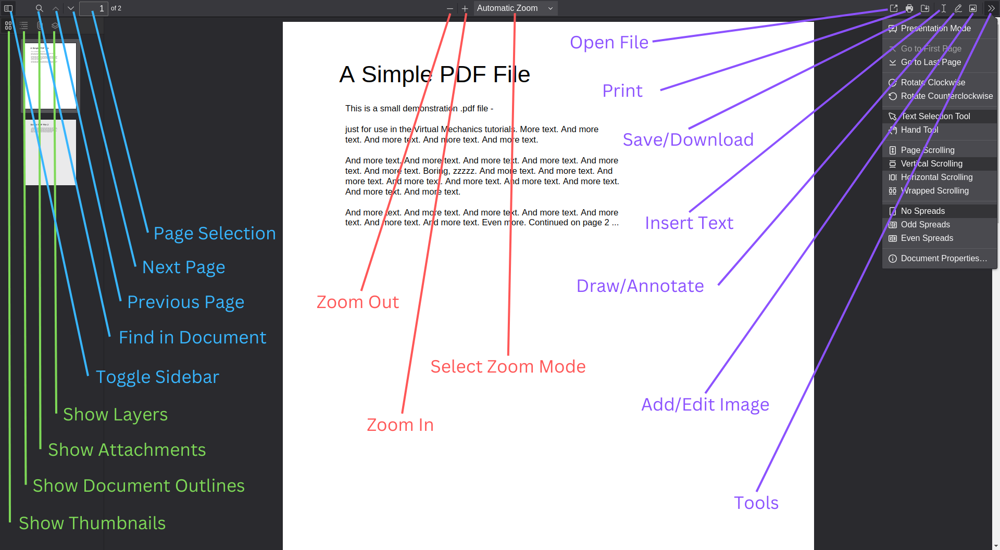

# pdfoxjs

> View and edit PDF documents

Cross-platform electron wrapper around Mozilla's [pdf.js](https://mozilla.github.io/pdf.js).

Support features present in the [pdf.js v4.0.189](https://github.com/mozilla/pdf.js/releases/tag/v4.0.189) release.

## Features

Please refer to the original documentation of [pdf.js](https://github.com/mozilla/pdf.js). There is also a demo for modern browsers released by Mozilla [here](https://mozilla.github.io/pdf.js/web/viewer.html). Below is a summarised list.



### Toolbar
- Toggle Sidebar
- Find in Document (Search)
- Page Selection
- Zoom
- Open File
- Print
- Save (Download)
    - This Includes Text, Drawing/Annotation, Filled Form Inputs, and Inserted Images
    - Page Rotations Are Not Saved
- Insert Text
- Draw (Annotate)
- Add/Edit Images
- Tools
    - Presentation Mode
    ---
    - Go to First Page
    - Go to Last Page
    ---
    - Rotate Clockwise
    - Rotate Counterclockwise
    ---
    - Text Selection Tool
    - Hand Selection Tool
    ---
    - Page Scrolling
    - Vertically Scrolling
    - Horizontal Scrolling
    - Wrapped Scrolling
    ---
    - No Spread
    - Odd Spread
    - Even Spread

### Sidebar
- Show Thumbnails
- Show Document Outline
- Show Attachments
- Show Layers

### Viewer
- Select Text
    - Copy
    - Search with Google
    - Inspect (only in development mode)
- Open Links (will open a new tab in your default browser)
- Fill Forms
    - `<TAB>` and `<SHIFT-TAB>` to navigate forward and backward between form inputs
    - `<SPACE>` inside checkbox to toggle selection
    - `<ENTER>` in multi-lines input box for new lines

### Shortcuts

#### Original Shortcuts

Below are the default [PDF Viewer keyboard shortcuts](https://support.mozilla.org/en-US/kb/view-pdf-files-firefox-or-choose-another-viewer#w_pdf-viewer-keyboard-shortcuts).
| Command |  Shortcut |
|---------------|-------|
| Next page | `n` or `j` or `ArrowRight` |
| Previous page | `p` or `k` or `ArrowLeft[]` |
| Zoom in | `Ctrl` + `+` |
| Zoom out | `Ctrl` + `-` |
| Automatic zoom | `Ctrl` + `0` |
| Rotate clockwise | `r` |
| Rotate counterclockwise | `R` (`Shift` + `r`) |
| Switch to Presentation Mode | `CTRL` + `ALT` + `p` |
| Choose Text Selection Tool | `s` |
| ~~Choose Hand Tool~~ | ~~`h`~~ (Note: this is overridden by vim bindings) |
| Focus the Page Number input box | `CTRL` + `ALT` + `g` |

#### Additional Shortcuts (Vim Bindings)

These will override any default PDF Viewer keyboard shortcuts.

| Command |  Shortcut |
|---------------|-------|
| Toggle Help | `?` (`SHIFT` + `/`) |
| Scroll Down | `j` |
| Scroll Up | `k` |
| Scroll Right | `h` |
| Scroll Left | `l` |
| Scroll to Bottom | `G` |
| Scroll to Top | `gg` (press `g` twice) |


## Project Setup (Development)

### Install

```bash
$ yarn install
```

### Development

```bash
# Transpile and run electron app
$ yarn start

# Simple express server
$ yarn dev
```

### Build

```bash
# For windows
$ yarn build:win

# For macOS
$ yarn build:mac

# For Linux
$ yarn build:linux
```